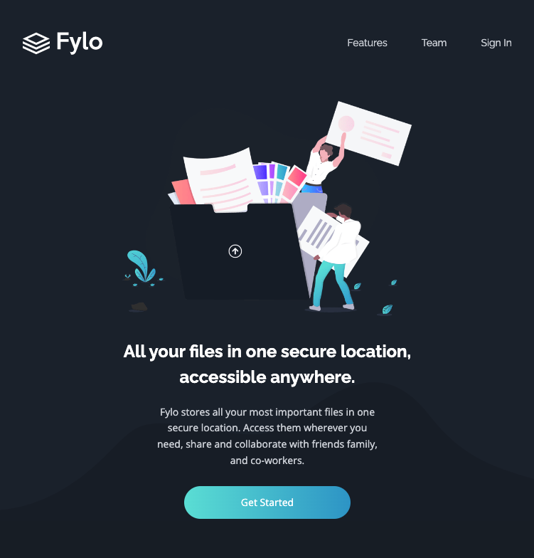
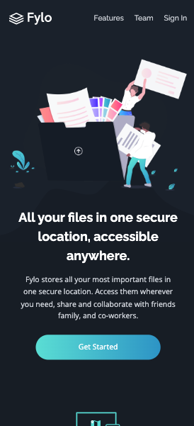

# Frontend Mentor - Fylo dark theme landing page solution

This is a solution to the [Fylo dark theme landing page challenge on Frontend Mentor](https://www.frontendmentor.io/challenges/fylo-dark-theme-landing-page-5ca5f2d21e82137ec91a50fd). Frontend Mentor challenges help you improve your coding skills by building realistic projects. 

## Table of contents

- [Overview](#overview)
  - [Live Site](#live-site)
  - [The challenge](#the-challenge)
  - [Screenshots](#screenshot)
- [My process](#my-process)
  - [Built with](#built-with)
  - [What I learned](#what-i-learned)
  - [Continued development](#continued-development)
  - [Useful resources](#useful-resources)
- [Author](#author)

## Overview

### Live Site

[Live Site](https://malcolmtann.github.io/Flyo-Landing-Page/)

### The challenge

Users should be able to:

- View the optimal layout for the site depending on their device's screen size
- See hover states for all interactive elements on the page

### Screenshot

<br>


Tablet View
<br>


Mobile View
<br>


## My process

### Built with

- Semantic HTML5 markup
- Tailwindcss
- JavaScript

### What I learned

Styling content with Tailwindcss
```html
  <header class="px-5 pt-10 bg-intro md:pt-14 md:px-10 lg:px-12 2xl:px-16">
    <nav class="flex justify-between items-center">
      <a href="#" title="Flyo Logo"></a>
      <ul class="flex gap-5 font-railway md:gap-12">
          <li><a class="transition-all duration-200 hover:text-white hover:underline" href="#" title="Features">Features</a></li>
          <li><a class="transition-all duration-200 hover:text-white hover:underline" href="#" title="Team">Team</a></li>
          <li><a class="transition-all duration-200 hover:text-white hover:underline hover:scale-90" href="#" title="Sign In">Sign In</a></li>
      </ul>
    </nav>
  </header>
```

How to set custom styling with the config file
```js
/** @type {import('tailwindcss').Config} */
module.exports = {
  content: ['./public/*.html'],
  theme: {
    extend: {
      fontFamily: {
        openSans: "'Open Sans', sans-serif",
        railway: "'Raleway', sans-serif",
      },
      colors: {
        intro: '#1c2431',
        main: '#181f2a',
        test: '#202a3c',
        footer: '#0b1523',
        white: '#fff',
        cyan: '#65e2d9',
        blue: '#339ecc',
        error: '#ff4242',
      },
    },
  },
  variants: {
    fill: ['hover', 'focus'],
  },
}
```

Email Validation through JavaScript
```js

```

### Continued development

- I want to continue learning and familiarizing myself with new technologies and frameworks to keep up to date with the fast-paced and evolving tech industry.  

- I always want to be improving my skillset in JavaScript, as it is the most universial front-end language that will help me excel the most in my field of work. 

### Useful resources

- [Dave Gray](https://www.youtube.com/watch?v=pYaamz6AyvU&t=830s&ab_channel=DaveGray) - A super simple and straight forward introductory tutorial that helped me get started with tailwindcss


## Author

- Malcolm Tan
- [malcolm-tan.com](https://malcolm-tan.com/)
- [LinkedIn](www.linkedin.com/in/malcolmtan-)

